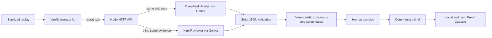

# CrisisRoute AI

Evidence-backed crisis triage support that separates verification, urgency, and actionability before a human makes the operational decision.

> **LOW VERIFICATION ≠ LOW URGENCY. AI assists. Humans decide.**

## Problem

Crisis reports arrive as incomplete messages, duplicate forwards, conflicting observations, and urgent claims without enough location or contact detail. A binary true/false label can hide a dangerous report simply because its evidence is weak. CrisisRoute AI keeps uncertainty visible while independently evaluating how urgent the harm would be if the report were true and whether a safe, human-approved response is actionable.

This hackathon demo does not replace 999, hospitals, police, fire and rescue services, NADMA, DOE, or any other official emergency authority.

## Product Workflow

1. Receive user-provided report text or the fixed five-case haze scenario.
2. Send the same original evidence to a DeepSeek Analyst and a blind Kimi Reviewer through GonkaRouter.
3. Validate both structured responses and score three independent axes.
4. Compute deterministic consensus, disagreement, operational state, and safety gates.
5. Require an explicit human decision; no real-world action is automatically executed.
6. Generate a deterministic operational brief, append a local audit event, and verify a local Proof Capsule.

## Why Gonka Is Essential

Live mode uses GonkaRouter as the server-side inference gateway. A complete five-case Analyze makes exactly two model calls: one to `deepseek-ai/DeepSeek-V4-Flash-0731` and one to `moonshotai/Kimi-K2.6`. The Reviewer receives the same original reports but never the Analyst output, reducing anchoring and allowing meaningful disagreement.

Gonka Response IDs are retained as observability references. They are not blockchain records, evidence that a report is true, or proof that an action occurred.

## Three-Axis Scoring

- **Verification** — strength and independence of supporting evidence.
- **Urgency** — severity and time sensitivity of harm if the claim is true.
- **Actionability** — whether location, contact, resources, and a safe next step are sufficiently complete for human approval.

Scores are validated from 0–100. Missing, nonnumeric, infinite, or out-of-range values are rejected rather than guessed or clamped.

## Deterministic Consensus

The application averages each axis in code and measures the Analyst/Reviewer gap. A maximum gap up to 15 is agreement, 16–30 is disagreement, and above 30 is critical conflict. Model prose does not control the final state.

## Safety Gates

Deterministic gates cover medical risk, exact location, contact path, resource availability, model conflict, and dispatch eligibility. Weak verification never lowers urgency automatically. Critical conflict, missing operational details, or failed gates keep dispatch locked for human review.

## Human Decision

Allowed actions depend on the deterministic operational state. Decisions require the relevant acknowledgements and are recorded in an in-memory append-only audit chain. `RECORDED` means the decision was saved locally; execution remains `NOT_EXECUTED`.

## Deterministic Brief

After a valid decision, server-side code produces a bounded operational brief from validated analysis and decision context. The brief does not claim that contact, dispatch, treatment, delivery, or rescue occurred.

## Local Proof Capsule

The Proof Capsule hashes the local analysis/decision/brief payload and verifies tampering within the running process. It provides local payload-integrity evidence only. There is no blockchain anchoring, external timestamp authority, persistent database, or proof that the underlying report is true.

## Data Modes

| Mode | Meaning |
|---|---|
| Live | Real DeepSeek and Kimi inference through GonkaRouter. Upstream availability and timeouts apply. |
| Replay | Sanitized deterministic replay of an earlier accepted Live run. The current replay load makes no network request. |
| Demo | Synthetic local data for UI and workflow demonstration. |

An upstream failure never becomes a fabricated Live result. Safe timeouts, failed-role reporting, manual retry, and an explicitly labelled Replay fallback are provided. Structured rationale fields are bounded output fields; they are not hidden chain-of-thought.

## Architecture



## Repository Structure

```text
backend/    Gonka client, analysis pipeline, decision ledger, brief service
src/        Browser UI, client adapter, demo and replay data
scripts/    Offline smokes, live rehearsal, release audit
tests/      Node test suite
docs/       Integration, runbook, pitch, and submission documentation
server.js   Static allowlist and API server
render.yaml Render Web Service configuration
```

## Local Setup

Requirements: Node.js 24 and npm.

```powershell
Copy-Item .env.example .env.local
npm ci --omit=dev
npm run dev
```

Open `http://localhost:4173`. Never commit `.env.local` or put the key in browser code.

### `.env.local`

```text
GONKA_API_KEY=<server-side secret>
GONKA_BASE_URL=https://api.gonkarouter.io/v1
GONKA_ANALYST_MODEL=deepseek-ai/DeepSeek-V4-Flash-0731
GONKA_REVIEWER_MODEL=moonshotai/Kimi-K2.6
```

Development keeps the existing key-based local workflow. Production additionally requires `GONKA_LIVE_ENABLED=true` and uses `GONKA_MAX_ANALYSES_PER_PROCESS` for the single-process demo budget.

## Available Commands

| Command | Purpose |
|---|---|
| `npm run dev` | Start local server with optional `.env.local` loading |
| `npm start` | Start the server using process environment variables |
| `npm test` | Run all offline tests |
| `npm run smoke:decision` | Offline human-decision smoke |
| `npm run smoke:brief` | Offline brief/proof smoke |
| `npm run smoke:frontend` | Offline frontend workflow smoke |
| `npm run smoke:judge` | Offline judge-demo smoke |
| `npm run audit:release` | Offline release package audit |
| `npm run rehearse:live` | Explicitly authorized Live rehearsal; consumes model requests |

## API Routes

- `GET /api/health/ready` — deployment readiness without contacting Gonka.
- `GET /api/health/gonka` — safe configured-capability status without inference.
- `POST /api/incidents/analyze` — CASE 01 or fixed five-case analysis.
- `POST /api/incidents/:id/decision` — record a bounded human decision.
- `GET /api/incidents/:id/audit` — retrieve the in-memory audit chain.
- `POST /api/incidents/:id/brief` — generate deterministic brief and capsule.
- `POST /api/proof/verify` — verify local payload integrity.

## Render Deployment

`render.yaml` defines a Node Web Service using `npm ci --omit=dev`, `npm start`, and `/api/health/ready`. Add `GONKA_API_KEY` only in Render's secret environment UI. Render supplies `PORT`; no persistent disk is configured. Decision, audit, brief, and proof records are ephemeral and disappear when the instance restarts.

Deployment is prepared but not published in B12-A. See the [Demo Runbook](docs/DEMO_RUNBOOK.md) before presenting.

## Testing

The suite covers strict role contracts, blind-review isolation, safe errors, timeouts, response limits, consensus, gates, human decisions, audit integrity, proof tampering, replay provenance, production readiness, cost protection, HTTP headers, graceful shutdown, and release packaging. Standard tests and release audits are offline; Live scripts must be invoked separately and intentionally.

## Security and Privacy

The API key remains server-side. Static files use an explicit allowlist, API responses use `Cache-Control: no-store`, and responses include CSP, clickjacking, MIME-sniffing, referrer, and permissions protections. Production Analyze permits one concurrent request and defaults to 12 submissions per process. This is demo cost protection, not a distributed production quota or abuse-prevention system.

See the [Security Policy](SECURITY.md) and [Privacy Notice](PRIVACY.md).

## Known Limitations

- No formal user authentication or authorization.
- No persistent database; decisions and audit records are ephemeral.
- No automatic public URL retrieval, web search, or private/login-page access. Intake processes text supplied by the user.
- No automatic rescue dispatch or integration with official emergency services.
- Live inference depends on GonkaRouter and upstream model availability.
- Replay is a sanitized fallback and must never be presented as a fresh Live run.
- Proof Capsule has no blockchain or external anchoring.
- Single-process concurrency and budget controls reset when the server restarts.

## Demo and Submission

- [Demo Runbook](docs/DEMO_RUNBOOK.md)
- [Gonka Integration](docs/GONKA_INTEGRATION.md)
- [Two-Minute Pitch](docs/PITCH_SCRIPT_2_MIN.md)
- [Submission Checklist](docs/SUBMISSION_CHECKLIST.md)

The submission package prepares placeholders for the required Live Demo URL, public GitHub repository, and two-minute pitch video. External publication is intentionally deferred.

## License

Licensed under the [MIT License](LICENSE).
